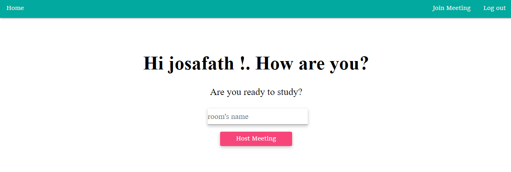
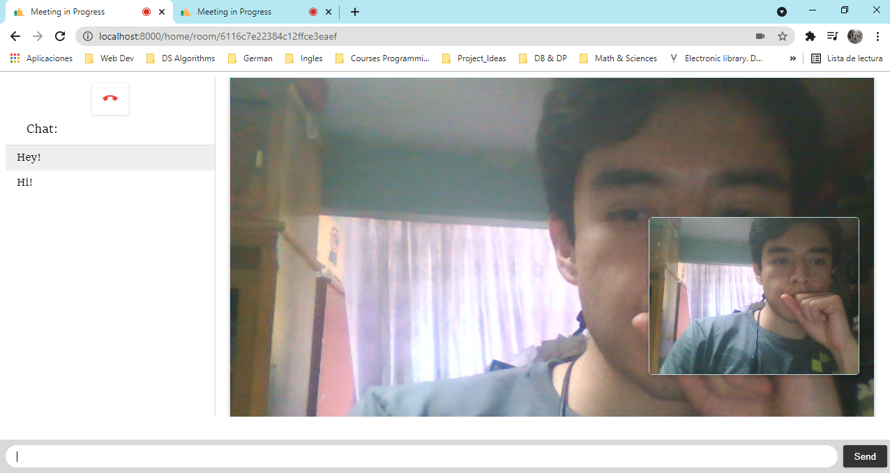

# video-chat

## How this project works ? 
Using socket.io, WebRTC API (no libraries) and Passport for authenticate users you can connect with someone creating a room or joining one  of your friends.
I try to make this project like if it was a real product.

### Pd:
This was the hardest project that I made, I've never been in a situation where I could feel many confusion and frustration for not knowing but then everything pays off.
If someone wants to collaborate of you have some thoughts of how I can improve this, send me an email. :)
This is the the link to the project:
https://protected-peak-11732.herokuapp.com/

If you wanna use this projects you will have to have this little things in mind.
## Setup
_In file main.js of the public dir you could see in line 37 the servers line, to use this software you have to follow this steps:_
- Go to https://xirsys.com/
- Sign up/Log in
- Create an app and then you would see in your right side of the browser *Static TURN credentials.*
- Once you click this button you could see and object with the iceServers
- Copy the object and paste in line 37.
- Note: If you have another way to write something that works, send me your code. haha

- Don't forget _npm install_

# Preview
### Menu

### Video chat in action. 😀

